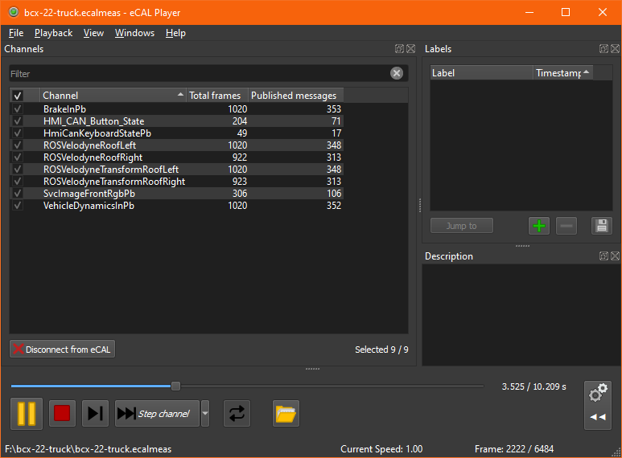

# Hack the Truck 🚚

Do you dream big? **Yes**?

Have you ever hacked an actual truck? **No**?

Well, here you can! We bring the truck - you bring your dream. Deal?

# Hardware & Software

The truck is not only a truck. We also added some cool hardware! With our modifications, the truck features the following exiting **sensors and actuators** you can work with:

Everything in the truck is connected to some PCs we have in the back. The PCs are connected to each other with a regular ethernet switch. For unifying the communication, our middleware **Eclipse eCAL™** (which is open source) is used. So, for receiving sensor data in your application and controlling actuators you only need to **connect your notebook** to the same switch.

## About Eclipse eCAL™

[Eclipse eCAL™](https://eclipse-ecal.github.io/ecal/) is our communication middleware for accessing sensor data. It works on a publish-subscribe pattern, where data is always sent to / received from a topic, that is identified by its name. In the background, eCAL will manage the data flow and make sure that the data from publishers is sent to the appropriate subscribers.

The scope of eCAL is high performant dataflow on localhost (intra-host) and over local networks (inter-host). The scope is _not_ internet / cloud communication.

eCAL also comes with some useful tools that will help you with your hack:
- The **eCAL Monitor** let's you graphically inspect messages that are sent by the sensors, without having to program anything
- The **eCAL Recorder + Player** duo lets you record and replay data, so you don't have to sit in the truck all the time. 

> **_See also_**
> - Read about [how to install eCAL](https://eclipse-ecal.github.io/ecal/getting_started/setup.html) on your PC
> - Visit the [eCAL github repo](https://github.com/eclipse-ecal/ecal)

# The Challenge

The challenge is to **get creative**. Get inspired by the vehicle. Do something amazing with the sensor setup. For the uncreative ones we have two ideas to start with:

- Detect passengers with the truck's cameras and indicate it on the roof-mounted LED bar
- Emulate a gamepad based on the truck's steering wheel and control your favorite racing game

_You will not be able to drive around with the truck. This is unfortunate, but probably expected._

## Prerequisites

For developing with eCAL, the Hacker should be familiar with at least one of the following **programming languages**:

- C
- C++
- Python

Besides from that, a Hacker would only need a **notebook**:

- With **Windows** (10 or 11) or **Ubuntu** (18.04 or newer)

    _Other Operating systems may work, but having one of these will save you some trouble._

- An **ethernet port** with at least 1 Gbit (onboard or via USB)

## Example projects

You can use the Example projects as a starting-point and modify those to your needs. They already correctly interface with the truck.

1. C++: [Camera Sample](samples/c++/camera/)
   
   This sample shows how to read the camera Images sent by the truck and display them in a Window.

2. Python: [Lightbar sample](samples/python/lightbar)
    
    This sample sends commands to the roof-mounted lightbar to toggle through the modes

> **_See also_**
>
> Also check out the [eCAL Hello World](https://eclipse-ecal.github.io/ecal/getting_started/hello_world.html)!

## Example eCAL Measurement

You can download an example eCAL measurement here:
https://drive.google.com/file/d/1HWQ-FJGs5MleIna3WKVW6O1U1-HTu6ZY/view?usp=sharing

After unzipping, you can open the measurement with the eCAL Player. It will look like this:

Please read [the datatypes section](/datatypes/README.md) for information on how to interpret the data.
Now you can use this to stimulate your software! 

Happy Hacking 😀
